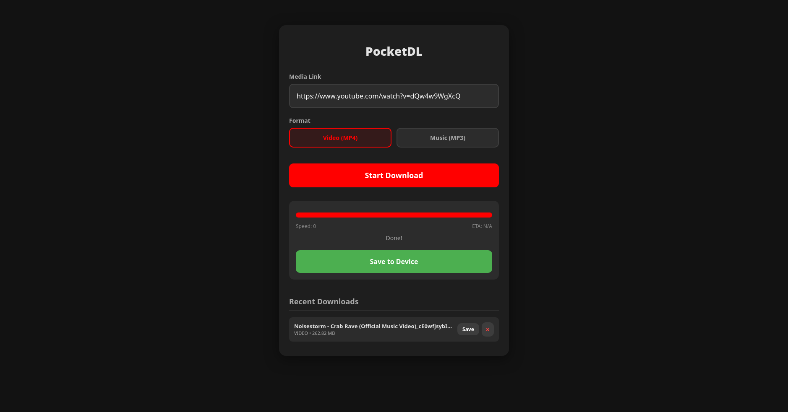

# PocketDL 🚀

A modern, lightweight, and Dockerized media downloader with a responsive Web UI.
Supporting **1000+ sites** (including YouTube, TikTok, Twitter/X, and Instagram) via the power of `yt-dlp`.
Perfect for downloading videos and music directly to your iOS, Android, or PC.



## ✨ Features

- **Multi-platform support**: Works seamlessly on iOS (Safari), Android, and Desktop.
- **High Quality**: Automatically fetches the best available quality (4K/8K supported).
- **Video & Audio**: Download as MP4 video or extract MP3 audio.
- **Download History**: See, re-download, or delete your recent files.
- **Always Up-to-Date**: Docker image is rebuilt weekly with the latest `yt-dlp`.
- **Dockerized**: Easy deployment with a single command.
- **Auto-Cleanup**: Automatically removes files older than 24 hours.

## 🐳 Quick Start with Docker

The easiest way to run PocketDL is using Docker:

1. **Clone the repository**:
   ```bash
   git clone https://github.com/jessepesse/PocketDL.git
   cd pocket-dl
   ```

2. **Start the service**:
   ```bash
   docker compose up -d --build
   ```

3. **Open in browser**:
   Navigate to `http://localhost:5050` (or your server's IP).

## 🛡️ Security Considerations

PocketDL is designed for **local use within a private home network**. If you intend to expose it to the internet, please consider the following:

- **No Built-in Authentication**: PocketDL does not currently have a login system. Use a reverse proxy (like Nginx, Traefik, or Caddy) with Basic Auth or OIDC if exposed publicly.
- **Server-Side Request Forgery (SSRF)**: The app fetches content from URLs provided by users. In an untrusted environment, this could be used to probe your internal network.
- **Resource Usage**: Multiple concurrent high-resolution downloads can consume significant CPU and bandwidth.

**Recommendation**: Run this behind a VPN (like WireGuard or Tailscale) for secure remote access without exposing ports to the public web.

## 🛠️ Manual Installation

If you prefer to run it without Docker:

1. **Install FFmpeg** (required for merging video/audio).
2. **Install requirements**:
   ```bash
   pip install -r requirements.txt
   ```
3. **Run the app**:
   ```bash
   python app.py
   ```

## 📜 License

This project is licensed under the MIT License - see the [LICENSE](LICENSE) file for details.
